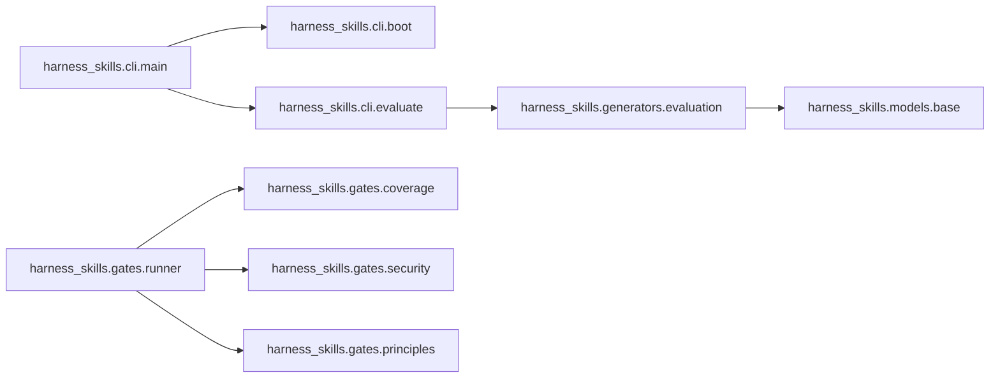

# Generate Docs

Populate **`docs/generated/`** with three categories of auto-derived documentation:
database / data-model schemas, HTTP API specifications, and module dependency graphs.
All output is regenerated from source on every run; the directory is safe to commit
because every file carries a `<!-- harness:auto-generated -->` header so the
`/doc-freshness-gate` skill knows it is machine-produced.

---

## Usage

```bash
# Full generation (all three categories)
/generate-docs

# Single category
/generate-docs --only schemas
/generate-docs --only api
/generate-docs --only graphs

# Dry-run — show what would be written, write nothing
/generate-docs --dry-run

# Override output directory (default: docs/generated/)
/generate-docs --out-dir docs/generated/

# Suppress the Mermaid diagram and emit plain adjacency list instead
/generate-docs --graphs-format dot
```

---

## Instructions

### Step 0 — Prepare the output directory

```bash
mkdir -p docs/generated/schemas
mkdir -p docs/generated/api
mkdir -p docs/generated/graphs
```

Record `GEN_TIMESTAMP` (ISO-8601 UTC) and `GEN_HEAD` (current git SHA):

```bash
GEN_TIMESTAMP=$(date -u +"%Y-%m-%dT%H:%M:%SZ")
GEN_HEAD=$(git rev-parse --short HEAD 2>/dev/null || echo "unknown")
```

Define the standard harness header snippet (interpolate before writing each file):

```
<!-- harness:auto-generated — do not edit this block manually -->
<!-- generated: <GEN_TIMESTAMP> -->
<!-- head: <GEN_HEAD> -->
<!-- /harness:auto-generated -->
```

---

### Step 1 — Detect the tech stack

Scan the repository root and source tree for framework markers.

#### 1a — Database / model frameworks

| Marker | Framework |
|---|---|
| `import sqlalchemy` or `from sqlalchemy` | SQLAlchemy |
| `from django.db import models` | Django ORM |
| `from pydantic import BaseModel` | Pydantic v1/v2 |
| `from tortoise` | Tortoise ORM |
| `from peewee` | Peewee ORM |
| `*.prisma` files | Prisma (JS/TS) |

```bash
grep -rl "from sqlalchemy\|import sqlalchemy" --include="*.py" . 2>/dev/null | head -5
grep -rl "from django.db import models" --include="*.py" . 2>/dev/null | head -5
grep -rl "from pydantic import BaseModel\|from pydantic.v1" --include="*.py" . 2>/dev/null | head -5
find . -name "*.prisma" -not -path "*/.git/*" 2>/dev/null | head -5
```

Store detected frameworks in `MODEL_FRAMEWORKS` list.

#### 1b — HTTP API frameworks

| Marker | Framework |
|---|---|
| `from fastapi import` | FastAPI |
| `from flask import Flask` | Flask |
| `from django.urls import` | Django REST / urls |
| `from starlette` | Starlette |
| `from aiohttp` | aiohttp |
| `express` in `package.json` | Express (Node) |

```bash
grep -rl "from fastapi import\|import fastapi" --include="*.py" . 2>/dev/null | head -5
grep -rl "from flask import Flask" --include="*.py" . 2>/dev/null | head -5
grep -rl "from django.urls import" --include="*.py" . 2>/dev/null | head -5
```

Store detected frameworks in `API_FRAMEWORKS` list.

#### 1c — Language

If `*.py` files dominate → `LANG=python`.
If `*.ts`/`*.tsx` files dominate → `LANG=typescript`.
If `*.go` files dominate → `LANG=go`.

---

### Step 2 — Generate database / data-model schemas

Produce one Markdown file per detected schema source, plus a rolled-up `index.md`.

#### 2a — SQLAlchemy

Find all files containing `Base` or `DeclarativeBase` subclasses:

```bash
grep -rl "class.*Base\|DeclarativeBase\|declared_attr" --include="*.py" . \
  | grep -v "__pycache__\|\.git\|migrations" \
  | head -30
```

For each file, extract class definitions whose body references `Column`, `mapped_column`,
or `relationship`:

```bash
grep -n "class \|Column\|mapped_column\|relationship\|ForeignKey" <file> 2>/dev/null
```

Render each table as a Markdown table:

```markdown
## `<TableName>` (`<module_path>`)

| Column | Type | Nullable | Default | Notes |
|--------|------|----------|---------|-------|
| id     | Integer | No | auto | primary key |
| name   | String(255) | No | — | |
| user_id | Integer (FK → users.id) | No | — | |

**Relationships:** `user` → `User` (many-to-one)
```

Write to `docs/generated/schemas/sqlalchemy.md`.

#### 2b — Pydantic models

Find all files that define classes inheriting from `BaseModel`:

```bash
grep -rn "class .*BaseModel" --include="*.py" . \
  | grep -v "__pycache__\|\.git\|test_\|_test\." \
  | head -50
```

For each class, extract fields (lines matching `field_name: type` or `Field(...)` calls):

```bash
grep -A 30 "class <ModelName>(.*BaseModel" <file> 2>/dev/null \
  | grep -E "^\s+\w+\s*:" | head -20
```

Render as Markdown table:

```markdown
## `<ModelName>` (`<module.path>`)

| Field | Type | Required | Default | Validation |
|-------|------|----------|---------|------------|
| name  | str  | yes      | —       | min_length=1 |
| age   | int  | no       | 0       | ge=0 |
```

Write to `docs/generated/schemas/pydantic.md`.

#### 2c — Django models

Find all files containing `models.Model` subclasses:

```bash
grep -rn "class .*(models\.Model)" --include="*.py" . \
  | grep -v "__pycache__\|\.git\|migrations" | head -30
```

Extract field declarations (lines containing `models.CharField`, `models.IntegerField`, etc.):

```bash
grep -n "models\.\(Char\|Integer\|Boolean\|Date\|Float\|Text\|Foreign\|Many\)Field" <file>
```

Render to `docs/generated/schemas/django-orm.md`.

#### 2d — Prisma schema

If `*.prisma` files were found in Step 1:

```bash
cat <schema.prisma>
```

Parse `model` blocks and render them as the same Markdown table format.
Write to `docs/generated/schemas/prisma.md`.

#### 2e — Schema index

Write `docs/generated/schemas/index.md`:

```markdown
<!-- harness:auto-generated — do not edit this block manually -->
<!-- generated: <GEN_TIMESTAMP> -->
<!-- head: <GEN_HEAD> -->
<!-- /harness:auto-generated -->

# Database & Data-Model Schemas

Auto-derived on <GEN_TIMESTAMP> from `<GEN_HEAD>`.

| File | Framework | Tables / Models |
|------|-----------|-----------------|
| [sqlalchemy.md](sqlalchemy.md) | SQLAlchemy | 12 |
| [pydantic.md](pydantic.md)     | Pydantic v2 | 8 |
| [django-orm.md](django-orm.md) | Django ORM  | 5 |
```

If no schema sources were found, write a placeholder:

```markdown
# Database & Data-Model Schemas

No recognized ORM or schema framework detected in this repository.
Add SQLAlchemy, Pydantic, Django ORM, or Prisma to enable schema generation.
```

---

### Step 3 — Generate API specifications

#### 3a — FastAPI

FastAPI exposes an OpenAPI schema at runtime; however, we generate it statically from
source to avoid needing a running server.

Find all files that create a `FastAPI()` instance or use `APIRouter()`:

```bash
grep -rl "FastAPI()\|APIRouter()" --include="*.py" . \
  | grep -v "__pycache__\|\.git\|test_" | head -20
```

For each file, extract route decorators:

```bash
grep -n "@app\.\|@router\." <file> 2>/dev/null \
  | grep -E "(get|post|put|patch|delete|head|options)\("
```

For every matched route, capture:
- HTTP method (from decorator name)
- Path string (first string argument)
- Function name on the next line
- Docstring if present (lines immediately after `def ...():`)
- Return type annotation if present

Build an OpenAPI-compatible YAML document:

```yaml
openapi: "3.1.0"
info:
  title: "<project-name> API"
  version: "<GEN_HEAD>"
  description: "Auto-generated from source. Do not edit manually."
  x-generated-at: "<GEN_TIMESTAMP>"

paths:
  /users/{id}:
    get:
      operationId: get_user
      summary: "Fetch a single user by ID"
      parameters:
        - name: id
          in: path
          required: true
          schema:
            type: integer
      responses:
        "200":
          description: "OK"
```

Write to `docs/generated/api/openapi.yaml`.

Also write a human-readable Markdown summary to `docs/generated/api/routes.md`:

```markdown
<!-- harness:auto-generated — do not edit this block manually -->
<!-- generated: <GEN_TIMESTAMP> -->
<!-- head: <GEN_HEAD> -->
<!-- /harness:auto-generated -->

# HTTP API Routes

| Method | Path | Handler | Summary |
|--------|------|---------|---------|
| GET    | /users | `get_users` | List all users |
| POST   | /users | `create_user` | Create a new user |
| GET    | /users/{id} | `get_user` | Fetch user by ID |
| DELETE | /users/{id} | `delete_user` | Remove user |
```

#### 3b — Flask

Find route registrations:

```bash
grep -rn "@app\.route\|@blueprint\.route\|add_url_rule" --include="*.py" . \
  | grep -v "__pycache__\|\.git\|test_" | head -40
```

Extract method list from `methods=[...]` argument. Render to the same Markdown table
format and append to `docs/generated/api/routes.md`.

#### 3c — Django URLs

Find `urlpatterns` lists:

```bash
grep -rn "path(\|re_path(\|url(" --include="*.py" . \
  | grep -v "__pycache__\|\.git\|test_\|migrations" | head -40
```

Parse path string and view name. Append to `docs/generated/api/routes.md`.

#### 3d — API index

Write `docs/generated/api/index.md`:

```markdown
<!-- harness:auto-generated ... -->

# API Specifications

| File | Format | Endpoints |
|------|--------|-----------|
| [openapi.yaml](openapi.yaml) | OpenAPI 3.1 | 24 |
| [routes.md](routes.md)       | Markdown    | 24 |
```

If no HTTP framework was detected, write a placeholder explaining what frameworks are
supported.

---

### Step 4 — Generate module dependency graphs

Produce a Mermaid `graph LR` diagram showing which modules import which others,
restricted to first-party code (skip `site-packages` / `node_modules`).

#### 4a — Collect imports (Python)

```bash
# Find all first-party Python files
find . -name "*.py" \
  -not -path "*/.git/*" \
  -not -path "*/__pycache__/*" \
  -not -path "*/node_modules/*" \
  -not -path "*/.venv/*" \
  -not -path "*/site-packages/*" \
  2>/dev/null | sort
```

For each file, extract import statements and normalise to dotted module paths:

```bash
grep -n "^import \|^from " <file> 2>/dev/null \
  | grep -v "^from __future__" \
  | sed 's/import \(.*\)/\1/' \
  | sed 's/from \(.*\) import.*/\1/' \
  | awk '{print $1}'
```

Keep only imports whose prefix matches the top-level package name(s) found in the
repository (e.g. `harness_skills`, `harness_dashboard`). Drop standard-library and
third-party imports by checking against the package directory names found via:

```bash
find . -maxdepth 2 -name "__init__.py" \
  -not -path "*/.git/*" \
  -not -path "*/.venv/*" \
  -not -path "*/site-packages/*" \
  | sed 's|/[^/]*$||' | sed 's|^\./||' | sort -u
```

#### 4b — Build adjacency list

Build a dict `edges: dict[str, set[str]]` where each key is a module and values are
the set of first-party modules it imports. Represent each module as its dotted path
relative to the project root (e.g. `harness_skills.gates.runner`).

#### 4c — Render Mermaid diagram

Write `docs/generated/graphs/dependencies.md`:

````markdown
<!-- harness:auto-generated — do not edit this block manually -->
<!-- generated: <GEN_TIMESTAMP> -->
<!-- head: <GEN_HEAD> -->
<!-- /harness:auto-generated -->

# Module Dependency Graph

Auto-derived from first-party imports in `<GEN_HEAD>`.

> **Note:** Only first-party modules are shown. Third-party and stdlib imports are omitted.
> Render with any Mermaid-compatible viewer (GitHub, GitLab, Obsidian, mermaid.live).


````

If `--graphs-format dot` was specified, render a Graphviz DOT file instead:

```dot
digraph dependencies {
  rankdir=LR;
  "harness_skills.cli.main" -> "harness_skills.cli.boot";
  ...
}
```

Write to `docs/generated/graphs/dependencies.dot`.

#### 4d — Graph statistics

Append a statistics section to `docs/generated/graphs/dependencies.md`:

```markdown
## Statistics

| Metric | Value |
|--------|-------|
| Total modules | 42 |
| Total edges | 87 |
| Most-imported module | `harness_skills.models.base` (14 dependents) |
| Largest fan-out | `harness_skills.cli.main` (9 imports) |
| Isolated modules (no imports, not imported) | 3 |
```

---

### Step 5 — Write the top-level index

Write `docs/generated/index.md`:

```markdown
<!-- harness:auto-generated — do not edit this block manually -->
<!-- generated: <GEN_TIMESTAMP> -->
<!-- head: <GEN_HEAD> -->
<!-- /harness:auto-generated -->

# Generated Documentation

This directory is fully auto-generated by `/generate-docs` and is safe to regenerate
at any time. **Do not edit these files manually** — changes will be overwritten on the
next run.

| Category | Directory | Contents |
|----------|-----------|----------|
| Database & Data-Model Schemas | [schemas/](schemas/index.md) | SQLAlchemy, Pydantic, Django ORM |
| HTTP API Specifications | [api/](api/index.md) | OpenAPI 3.1 YAML + route summary |
| Module Dependency Graphs | [graphs/](graphs/dependencies.md) | Mermaid + statistics |

## Regenerate

```bash
# From repo root — requires no running server
/generate-docs
```

## Freshness

Last generated from commit `<GEN_HEAD>` at `<GEN_TIMESTAMP>`.
The `/doc-freshness-gate` skill will flag this directory as stale if the source code
has changed since the recorded `head` SHA.
```

---

### Step 6 — Emit the generation report

Print a structured summary to stdout:

```
━━━━━━━━━━━━━━━━━━━━━━━━━━━━━━━━━━━━━━━━━━━━━━━━━━━━━━
  Generate Docs — completed
  head: <GEN_HEAD>   timestamp: <GEN_TIMESTAMP>
━━━━━━━━━━━━━━━━━━━━━━━━━━━━━━━━━━━━━━━━━━━━━━━━━━━━━━

Schemas
────────────────────────────────────────────────────
  docs/generated/schemas/sqlalchemy.md    12 tables   ✅
  docs/generated/schemas/pydantic.md       8 models   ✅
  docs/generated/schemas/index.md                     ✅

API Specifications
────────────────────────────────────────────────────
  docs/generated/api/openapi.yaml         24 routes   ✅
  docs/generated/api/routes.md            24 routes   ✅
  docs/generated/api/index.md                         ✅

Dependency Graphs
────────────────────────────────────────────────────
  docs/generated/graphs/dependencies.md  42 modules   ✅
  docs/generated/graphs/index.md                      ✅

Index
────────────────────────────────────────────────────
  docs/generated/index.md                             ✅

━━━━━━━━━━━━━━━━━━━━━━━━━━━━━━━━━━━━━━━━━━━━━━━━━━━━━━
  9 files written — 0 warnings — 0 errors
  Run /doc-freshness-gate to verify freshness on the
  next CI pass.
━━━━━━━━━━━━━━━━━━━━━━━━━━━━━━━━━━━━━━━━━━━━━━━━━━━━━━
```

Also emit a machine-readable JSON manifest to stdout after the summary:

```json
{
  "command": "generate-docs",
  "status": "passed",
  "timestamp": "<GEN_TIMESTAMP>",
  "head": "<GEN_HEAD>",
  "categories": {
    "schemas": {
      "files_written": ["docs/generated/schemas/sqlalchemy.md", "docs/generated/schemas/pydantic.md", "docs/generated/schemas/index.md"],
      "entities_found": 20,
      "frameworks": ["sqlalchemy", "pydantic"]
    },
    "api": {
      "files_written": ["docs/generated/api/openapi.yaml", "docs/generated/api/routes.md", "docs/generated/api/index.md"],
      "routes_found": 24,
      "frameworks": ["fastapi"]
    },
    "graphs": {
      "files_written": ["docs/generated/graphs/dependencies.md"],
      "modules_found": 42,
      "edges_found": 87
    }
  },
  "warnings": [],
  "errors": []
}
```

The schema matches `harness_skills.models.docs.GeneratedDocsReport`.

---

### Step 7 — Handle `--dry-run`

If `--dry-run` was passed:
- Perform all discovery (Steps 1–4) but write **no files**.
- Print the generation report with `[DRY RUN]` prefixed on each line.
- Emit the JSON manifest with `"dry_run": true`.
- Exit 0.

---

## Options

| Flag | Effect |
|---|---|
| `--only schemas` | Generate only the `docs/generated/schemas/` category |
| `--only api` | Generate only the `docs/generated/api/` category |
| `--only graphs` | Generate only the `docs/generated/graphs/` category |
| `--out-dir PATH` | Write output under `PATH` instead of `docs/generated/` (default) |
| `--dry-run` | Discover and report without writing any files |
| `--graphs-format mermaid` | Render dependency graph as Mermaid (default) |
| `--graphs-format dot` | Render dependency graph as Graphviz DOT |
| `--include-tests` | Include test files when scanning for models and routes |
| `--max-depth N` | Limit directory traversal depth for import analysis (default: 10) |

---

## When to run this skill

| Trigger | Recommended action |
|---|---|
| After adding new models, routes, or modules | **`/generate-docs`** ← you are here |
| Before opening a PR | `/generate-docs` then `/doc-freshness-gate` |
| As a CI step | Add `generate-docs` to your `.github/workflows/` or `.gitlab-ci.yml` |
| After a large refactor | `/generate-docs --only graphs` to verify no circular deps |

---

## Integration with other skills

- **`/doc-freshness-gate`** — reads the `<!-- harness:auto-generated -->` headers written
  by this skill and fails CI if `docs/generated/` is stale relative to the recorded `head`.
- **`/harness:context`** — the files in `docs/generated/` are candidates for the context
  manifest; agents can load `docs/generated/schemas/pydantic.md` instead of scanning raw
  source to understand the data model.
- **`/check-code`** — this skill is read-only and does not modify source code, so
  check-code gates are unaffected.

---

## Notes

- **No running server required** — all generation is static analysis of source files.
- **No third-party tools required** — uses only `grep`, `find`, `git`, and Python/awk
  builtins available in any standard CI environment.
- **Idempotent** — running this skill multiple times produces identical output for the
  same commit.
- **Safe to commit** — `docs/generated/` should be committed so reviewers can see the
  current schema and API surface without cloning and running the tool locally.
- **Incremental support** — use `--only <category>` to regenerate a single section when
  only that part of the codebase has changed, keeping the other sections stable.
